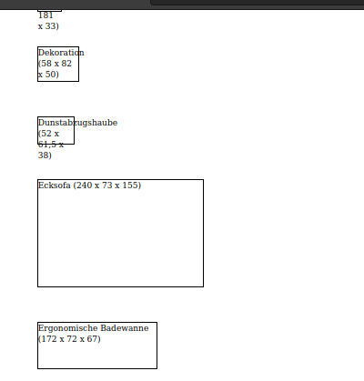

# SweetHome3dCsv2Html

Generates an HTML file with the contours for a list of furnitures
from the application SweetHome3D (CSV export).
The resulting HTML code/page can then be printed and used for modeling.

## Usage

1. Model your appartment with [SweetHome3D](www.sweethome3d.com).
2. Mark items in the furniture list, e.g. CTRL+A to mark them all.
3. Copy&Paste, i.e. CTRL+C then paste it in a CSV file.
4. (Optionally, adjust `htmlboxes.py`)
5. Run `python htmlboxes.py <FILE.CSV> > htmlboxes.html`
6. Open `htmlboxes.html` with Web-browser and print it.

